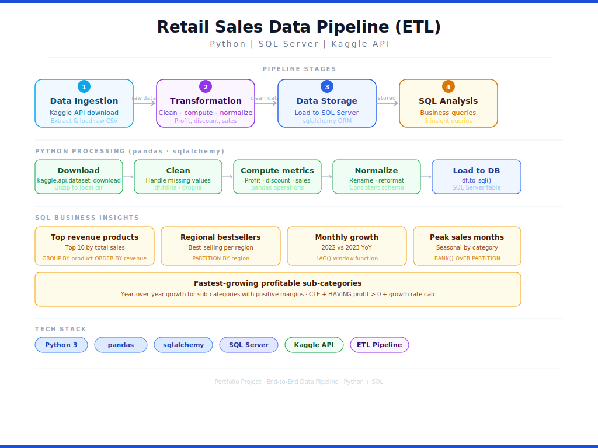

# Retail Orders Data Pipeline (Python + SQL)

This project demonstrates the design of an end-to-end data pipeline that ingests raw retail data, performs data transformation, and loads it into a structured database for analytical querying.

## What it does

- Downloads retail orders data from Kaggle
- Cleans and processes the data using Python
- Loads data into SQL Server
- Runs SQL queries to find business insights

## Key Features

**Python Data Processing:**
- Downloads and extracts data automatically
- Handles missing values
- Calculates profit, discounts, and sales metrics
- Loads clean data into database

**SQL Analysis:**
- Top 10 highest revenue products
- Best selling products by region
- Monthly sales growth (2022 vs 2023)
- Peak sales months for each category
- Fastest growing profitable sub-categories

## Technologies Used

- Python (pandas, sqlalchemy)
- SQL Server
- Kaggle API
  
## Data Pipeline Architecture

1. Data Ingestion  
   - Download dataset via Kaggle API  

2. Data Transformation  
   - Clean missing values  
   - Compute metrics (profit, discounts)  
   - Normalize dataset  

3. Data Storage  
   - Load processed data into SQL Server  

4. Data Analysis  
   - Execute SQL queries for business insights  

## Sample Insights

- Which products generate the most revenue
- How different regions perform
- Which months show the best growth
- What categories are most seasonal
- Which product lines are growing fastest

## Files

- Python script: Data download, cleaning, and database loading
- SQL queries: Business analysis and reporting

This project shows how to build a complete data pipeline from raw data to business insights using Python and SQL.
